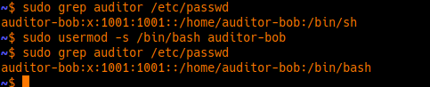
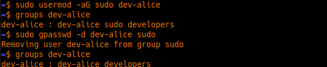
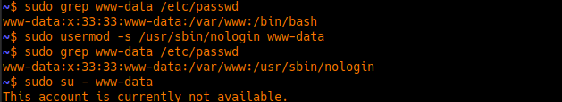

# Logs

## Scenario 1

- Created an `auditor-bob` user with a home directory, also add in group which has permission nginx logs.
- Issue: `auditor-bob:x:1001:1001::/home/auditor-bob:/bin/sh`
- Fixed: `auditor-bob:x:1001:1001::/home/auditor-bob:/bin/bash`

  

**Note**:

- On Ubuntu, `/bin/sh` is often a symbolic link to `dash`. It is a "bare-bones" shell.
- It lacks features like tab-completion or a nice colored prompt.

---

## Scenario 2

- Created a `dev-alice` user, add to groups of `developers` and `sudo`
- Issue: `dev-alice : dev-alice sudo developers`
- Fixed: Remove `dev-alice` user from group `sudo`

  

**Note**:

- If you used `sudo usermod -rG sudo dev-alice`, There is actually no `-r` flag for `usermod`. You likely meant
  "remove," but Linux doesn't work that way with `usermod`.
- To remove a user from a specific group safely, use: `sudo gpasswd -d dev-alice` sudo (The `-d` stands for delete from
  group).

---

## Scenario 3

- Check `www-data` user has shell access or not.
- Issue: It does, `www-data:x:33:33:www-data:/var/www:/bin/bash`.
- Fixed: Change it to "Non-Login Shell" so no one can ever log in as the webserver.

  

**Note**:

---

## Scenario 4

- Check nginx logs.
- Issue: permission set to `700`
- Fixed: Change to `755`, then restart the service.

**Note**: The Reason `nginx` don't show error is because:

- When Nginx starts, it opens the log file and gets a **File Descriptor (FD)**.

- Even if you change the permissions of the folder or the file later, Nginx already has the "key" (the FD) turned in the
  lock. It doesn't check the permissions again until it is **fully restarted** or told to **re-open** its logs.

---

## Scenario 5

- Blocked and Locked user `auditor-bob`

  ![s-5](./img/s-5.png
