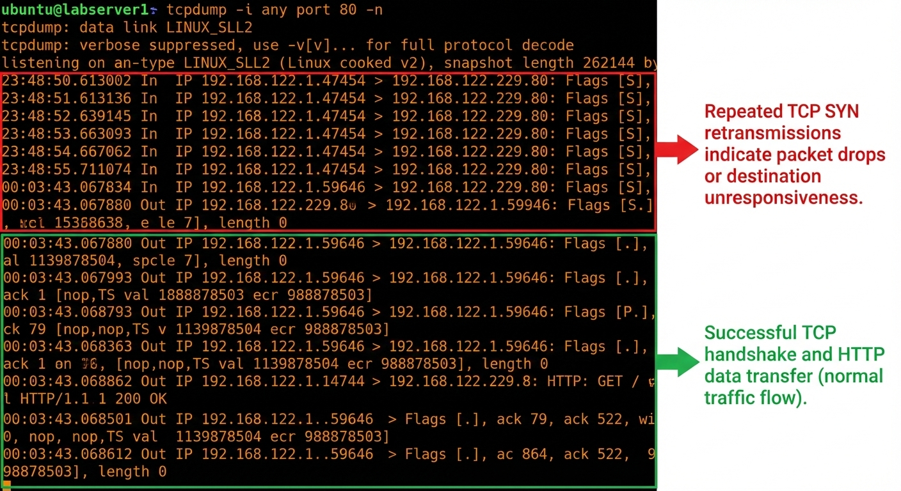

# Lab Logs

## Nginx Permission

- **Status:** Completed
- **Command Run:** `sudo chmod 000 /var/log/nginx`
- **Unexpected Behavior:** Site still loads. Why?
- **Hypothesis:** Master process (root) has the file open already.
- **Evidence:** `ls -la` shows 000, but `lsof -p <pid>` shows the file is open.

### Reasons

- **Process Inheritance**: The Nginx Master Process starts as root. It opens the log files before you changed the permissions. Once a file is opened, the kernel gives the process a File Descriptor (FD).
- **The "Key" is already in the lock**: Changing the directory permissions later (chmod 000) prevents new attempts to open the file, but it doesn't revoke the "key" (the FD) the process already holds in memory.
- **Kernel Logic**: The Linux kernel checks permissions at the time of opening, not at every single write operation.

## The Web Path

To `DROP` or `STOP` the packet/service & check behavior on host machine,

- **Status:** Completed
- **Command Run:** `sudo systemctl stop <SERVICE>`, `sudo iptables -A INPUT -p tcp --dport <PORT> -j DROP`
- **Unexpected Behavior:** `Couldn't connect`, `Connection time out`
- **Hypothesis:** Server port might **STOP** or **DROP**
- **Evidence:** `curl -v --max-time 8 <SERVER-IP>` result with Unexpected Behavior.
- **Add:** [`reset-lab.sh`](../scripts/reset-lab.sh) to restore lab.

To check drop packet in server,

- **Status:** Completed
- **Command Run:** `sudo tcpdump -i any port 80 -n`
- **Unexpected Behavior:** showing the TCP SYN packets reaching the interface, but no SYN-ACK was generated
- **Hypothesis:** Server firewall **DROP** the packets
- **Evidence:** Run `curl --max-time 8 <SERVER-IP>` & Check use `tcpdump` to know packets are droping or not

The client retries the SYN packet multiple times before timing out. Later drop stop and the SYN-ACK starting generated means now client get's packets.

