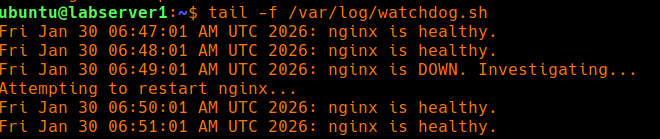
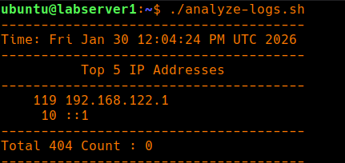

# Log

## Scripting Action

- **Issue**: Manually check if all 1000s of servers are running or not. If not then restart or log the event.
- **Action**: Created an automated recovery script to reduce **MTTR (Mean Time To Recovery)** after resource exhaustion events.
- **Observation**: Notice repeative task when doing manually.
- **Inference**: Script handle the issue.
- **Add**: [`watchdog.sh`](./watchdog.sh) to check on nginx service.
- **Evidence**: Run `./watchdog.sh`

---

## Automated Watchdog

- **Goal:** Automate Nginx recovery using Cron.
- **Problem:** Manual restarts take 5+ minutes of human time (Toil).
- **Automation Logic:** Script checks `systemctl is-active`. If 1, then restart.
- **Bug Found:** My first script didn't use absolute paths (e.g., `/usr/bin/systemctl`), so Cron failed to run it.
- **Learning:** Cron has a limited "PATH" environment. Always use full paths in scripts.
- **Evidence:** Check log `less -f /var/log/watchdog.log`
    

---

## Analyze Logs

- **Goal**: Look for top 5 IP in Logs. (Later add count `404`)
- **Problem**: Manual search, repeative lookup.
- **Action**: Put repeative task into script.
- **Script**: Provide Top 5 IP along with count.
- **Add**: [`analyze-logs.sh`](../scripts/analyze-logs.sh)
- **Evidence**: Run `./analyze-logs.sh`
    
